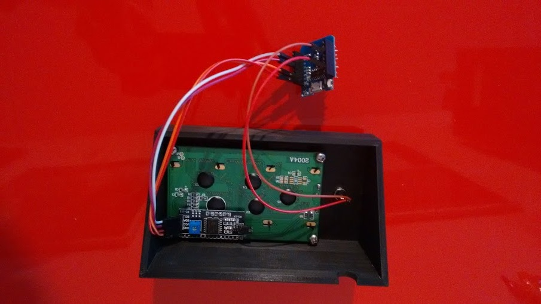
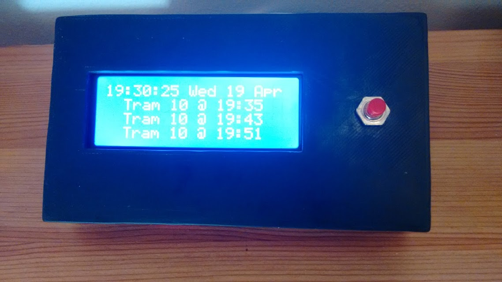
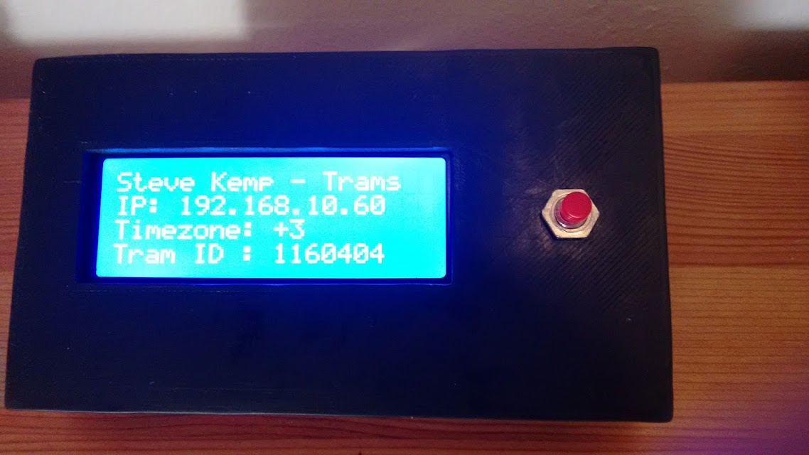

# Helsinki Tram Times

This project combines an ESP8266 processor with a LCD display, such that
it shows the next departures from a given Helsinki tram-stop.

> **NOTE**: In all this project we talk about "trams", but what we _actually_ display is departures from a given location.  If the location is a tram-stop you'll see tram-details, and if the location is a bus-stop you'll see bus-details.  (There are no stops in Helsinki which allow both trams _and_ busses!)

The code is self-contained, and is introduced on the project homepage:

* https://steve.fi/Hardware/helsinki-tram-times/

# Images

These images show the final result:

This is the first time I've had anything 3d-printed, but the process was pretty simple, because somebody else designed the case and I could download that design for free!

* http://blog.steve.fi/3d_printing_is_cool.html

# Configuration

Once compiled and uploaded the project will attempt to connect to your
local WiFi network.  If no access details have been stored previously
it will instead function as an access-point named `TRAM-TIMES`.

Connect to this access-point with your mobile, or other device, and
you can select which network it should auto-join in the future.

> (This "connect or configure" behaviour is implemented by the excellent [WiFiManager](https://github.com/tzapu/WiFiManager) class.)

The only addition configuration required is to set the stop to view - by
default it will show the departures of the stop near my house:

* [Kytösuontie](https://beta.reittiopas.fi/pysakit/HSL:1160404).

To change the tram-stop open the IP address in your browser and use
the HTML-form to submit the new ID, which you can find by panning/zooming
the map linked to above.

## Remote API

The script by parses and displays a simple CSV file which is hosted
remotely.  By default that is:

     https://api.steve.fi/Helsinki-Transport/data/__ID__

You can use your browser to replace that end-point with one of your
own choosing - which means that you can host it yourself, and write
your own tram-data there.

This will allow you to use this project with zero changes to the code!

The CSV has the following three fields:

* Identifier
  * (i.e. tram-route, or bus-route).
 Time
  * HH:MM:SS
* Destination
  * i.e. "Kirurgi", "Olympiaterminaali - Töölö - Länsi-Pasila", etc.

# Optional Button

If you wire a button between D0 & D8 you gain additional functionality:

* Short-Press the button to toggle the backlight.
* Double-click to show a brief information-page.
* Long-Press the button to resync the device:
  * Date/time
  * Departure-data.
  * Temperature data (if appropriate)

The info-page looks like this:

